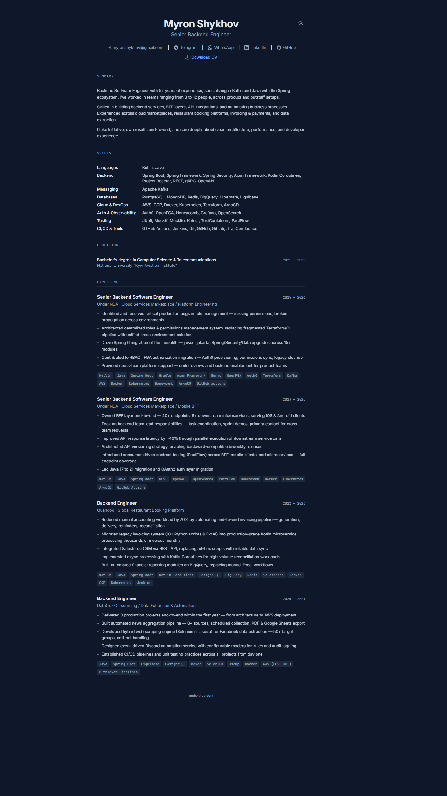

# CV Site

Config-driven CV/portfolio site. All personal info lives in **one file** — edit it and deploy.

Built with Next.js 15, React 19, TypeScript, and Tailwind CSS. Static export for Cloudflare Pages (or any hosting).

**Live:** [mshykhov.com](https://mshykhov.com)

## Preview

<details>
<summary>Desktop</summary>
<p align="center">
  
</p>
</details>

<details>
<summary>Mobile</summary>
<p align="center">
  
</p>
</details>

## Quick Start

1. Fork / clone this repo
2. Edit `src/data/resume.ts` — all your content and metadata
3. Replace `public/resume.pdf` with your CV
4. Deploy

That's it. No other files need editing for content changes.

## Config Reference

All site content is controlled by a single config object in `src/data/resume.ts`:

| Field | Description |
|---|---|
| `meta.title` | Page title and OG title (e.g. `"John Doe — Software Engineer"`) |
| `meta.description` | Meta description for SEO |
| `meta.url` | Canonical site URL (e.g. `"https://example.com"`) |
| `meta.keywords` | SEO keywords array |
| `meta.locale` | OG locale (e.g. `"en_US"`) |
| `personal.name` | Your full name |
| `personal.role` | Job title / role |
| `personal.initials` | 1-3 letter initials for auto-generated favicon |
| `contacts` | Array of contact links — `type`, `label`, `value` |
| `resume.url` | Path to PDF (default `"/resume.pdf"`) |
| `resume.filename` | Download filename (e.g. `"DOE_JOHN_CV.pdf"`) |
| `resume.label` | Download button text |
| `summary` | Array of summary paragraphs |
| `experience` | Array of jobs with company, title, period, domain, stack, highlights |
| `skills` | Array of skill categories with name and items |
| `education` | Degree, university, period |

### Contact Types

Supported `type` values: `"email"`, `"telegram"`, `"whatsapp"`, `"linkedin"`, `"github"`.

Each type auto-maps to the correct icon and URL format.

## Customization

- **Colors** — edit CSS variables in `src/app/globals.css` (light and dark themes)
- **Fonts** — change Google Fonts imports in `src/app/layout.tsx`
- **Favicon** — auto-generated from `personal.initials` in config
- **OG Image** — replace `public/og-image.png` (1200x630px) for social media link previews (LinkedIn, Telegram, Twitter)

## Local Development

```bash
npm install
npm run dev
```

Open [http://localhost:3000](http://localhost:3000).

## Build

```bash
npm run build
```

Output in `out/` directory (static HTML).

## Deployment (Cloudflare Pages)

### 1. Buy a Domain on Cloudflare

1. Go to [Cloudflare Dashboard](https://dash.cloudflare.com/) and create an account (or log in)
2. Navigate to **Domain Registration** > **Register Domains**
3. Search for the domain you want and complete the purchase

> If you already own a domain elsewhere, you can transfer it to Cloudflare or just add it by changing your nameservers.

### 2. Repository Setup

1. Fork or clone this repo to your GitHub account
2. Edit `src/data/resume.ts` with your info
3. Replace `public/resume.pdf` with your CV
4. Push to GitHub

### 3. Cloudflare Pages Setup

1. In the [Cloudflare Dashboard](https://dash.cloudflare.com/), go to **Workers & Pages** > **Create** > **Pages** > **Connect to Git**
2. Authorize Cloudflare and select your repository
3. Configure build settings:

| Setting | Value |
|---|---|
| **Production branch** | `main` |
| **Framework preset** | `Next.js (Static HTML Export)` |
| **Build command** | `npm run build` |
| **Build output directory** | `out` |

4. Click **Save and Deploy**

### 4. Connect Custom Domain

1. Go to your Pages project > **Custom domains** > **Set up a custom domain**
2. Enter your domain — Cloudflare will auto-configure DNS
3. Wait for SSL certificate provisioning

Every push to `main` auto-deploys.

## Project Structure

```
src/
  app/          # Next.js pages, layout, favicon generator
  components/   # React components (read from config, zero hardcoded data)
  data/         # resume.ts — single source of truth for all content
  types/        # TypeScript interfaces
public/         # Static assets (resume.pdf)
```
